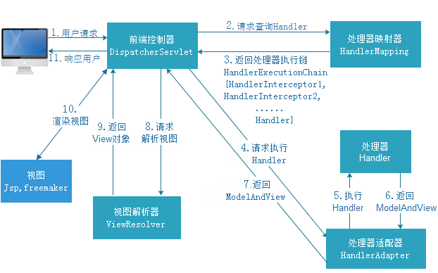

# Springmvc的学习

## 1.Springmvc的介绍

​	springmvc是表现层的框架，它是Spring框架的一部分。它处理请求的流程如下：

- 用户发送请求至前端控制器DispatcherServlet

- DispatcherServlet收到请求调用HandlerMapping处理器映射器

- 处理器映射器根据请求url找到具体的处理器，生成处理器对象及处理器拦截器（如果有则生成）一并返回给DispatcherServlet

- DispatcherServlet通过HandlerAdapter处理器适配器调用处理器

- 执行处理器Controller（也叫后端控制器）

- Controller执行完成后返回ModelAndView

- HandlerAdapter将controller执行结果ModelAndView返回给DispatcherServlet

- DispatcherServlet将ModelAndView传给ViewReslover视图解析器

- ViewReslover解析后返回具体view

- DispatcherServlet对view进行渲染视图

- DispatcherServlet响应用户

  流程图如下：

  ​	

  说明：在springmvc的各个组件中，处理器映射器(HandlerMapping)，处理器适配器(HandlerAdapter)，视图解析器（ViewResolver）称为springmvc的三大组件，需要用户开发的组件有handler,view

## 2.Springmvc的使用

- 1.导入需要的Jar包，具体看项目

- 2.书写springmvc的核心配置文件springmvc.xml，在classpath目录下书写文件

  ```xml
  <?xml version="1.0" encoding="UTF-8"?>
  <beans xmlns="http://www.springframework.org/schema/beans"
  	xmlns:xsi="http://www.w3.org/2001/XMLSchema-instance" xmlns:p="http://www.springframework.org/schema/p"
  	xmlns:context="http://www.springframework.org/schema/context"
  	xmlns:mvc="http://www.springframework.org/schema/mvc"
  	xsi:schemaLocation="http://www.springframework.org/schema/beans http://www.springframework.org/schema/beans/spring-beans-4.0.xsd
          http://www.springframework.org/schema/mvc
           http://www.springframework.org/schema/mvc/spring-mvc-4.0.xsd
          http://www.springframework.org/schema/context http://www.springframework.org/schema/context/spring-context-4.0.xsd">
          
          <!-- 1.配置扫描@Controller注解,base-package值为扫描的基本包 -->
          <context:component-scan base-package="cn.xiaozou"/>
       	 <!-- 2.配置处理器适配器，处理器映射器 -->
  		<mvc:annotation-driven />
  </beans>
  ```

- 3.在web.xml中配置前端控制器

  ```xml
  <!-- 1.配置前端控制器Servlet，SpringMvc的核心 -->
    <servlet>
    	<servlet-name>dispatchServlet</servlet-name>
    	<servlet-class>org.springframework.web.servlet.DispatcherServlet.class</servlet-class>
    	<!-- 配置初始化参数 -->
    	<init-param>
    		<param-name>contextConfigLocation</param-name>
    		<param-value>classpath:springmvc.xml</param-value>
    	</init-param>
    </servlet>
    <servlet-mapping>
    	<servlet-name>dispatchServlet</servlet-name>
    	<!-- 	
    		拦截路径问题:
    			1./**	在springmvc中拦截所有，包括jsp，不推荐使用，在struts2中不拦截jsp
    			2./		在springmvc中拦截除jsp外的所有，推荐使用在电商项目等
    			3.*.action 在springmvc中拦截以action结尾的url，使用在erp,crm,cms系统
    	 -->
    	<url-pattern>*.ation</url-pattern>
    </servlet-mapping>
  ```

## 3.Springmvc的注解介绍

- 1.@RequestMapping：作用配置映射url，以及对应请求的方式

   ```java
   	/**
   	 * RequestMapping注解详解
   	 * 1.value：映射的url，可以映射多个 
   	 * 2.method:请求的方式，默认是所有方式都支持，当我们限定后
   	 * 方式就被我们确定了，可以写多个请求方式
   	 * 3.produces="text/json;charset=UTF-8",限制输出的类型，以及编码
   	 */
   	@RequestMapping(value = { "test", "Test" }, method = { RequestMethod.GET, RequestMethod.POST })
   ```
- 2.@RequestParam:获取前端页面传送过来的数据

  ```java
  	/**
    	 * RequestParam的注解详解:
    	 * 	value：前端提交过来的字段name
    	 *  defaultValue:如果前台没有输入对应值的时候，就使用这里默认的值
    	 *  required:是否为必须的，如果设置为必须，前端没有name字段输入的话，就会报错
    	 *  		如果设置为false，就不会报错，默认为true
    	 */
    	@RequestMapping(value="/testParam",produces="text/json;charset=UTF-8")
  ```

- 3.@PathVariable：获取url参数中的值

  ```java
  	/**
  	 * PathVariable:获取url参数中的值
  	 * @param id
  	 * @return
  	 */
  	@RequestMapping("/testPathVariable/{id}")
  	@ResponseBody
  	public String test(@PathVariable String id){
  		return id;
  	}
  ```

- 4.@ResponseBody作用：页面不跳转，将返回的对象转换成json格式字符串

  ```java
  
    	/**
    	 * ResponseBody
    	 * 	1.将返回的对象转成json字符串
    	 *  2.如果打了@ResponseBody注解页面就不会跳转
    	 *  3.方法返回值设置成需要转换的对象
    	 */
    	@RequestMapping("/testResponseBody")
    	@ResponseBody
    	public Person testResponseBody(){	
  ```


- 5.@RequestBody

  ​	作用：将前端页面提交过来的json数据封装成实体对象

## 4.参数绑定

- 1.基本参数绑定：当请求参数名称和处理器形参名称一致时会将请求参数进行自动绑定

- 2.绑定pojo类型：要求pojo对象中的属性名和表单中input的name属性一致

- 3.绑定包装类型：要求input的name属性值对应包装类的属性

- 4.绑定数组：要求多个input标签的name属性值一样，这样springmvc会自动将它们转换成一个数组

  ```java
  						** controller接收数据方面 **
  public String batchDelete(Integer[] id){
  ```

- 5.绑定List集合：要求创建一个包装类对象QueryVo,在里面设置对应的List属性list，在input方面的name属性写name=list[0].xxx，springmvc接收的时候就直接用QueryVo接收

  ```html
  							** html方面 **
  <c:forEach items="${itemList }" var="item" varStatus="Num">
  				<tr>
  					<td>
  						<input type="checkbox" value="${item.id }" name="id">
  						<input type="text" value="${item.name }" name="itemList[${Num.index }].name">
  					</td>
  					<td>
  						<input type="text" value="${item.price }" name="itemList[${Num.index }].price">
  					</td>
  					<td><fmt:formatDate value="${item.createtime}"
  							pattern="yyyy-MM-dd HH:mm:ss" /></td>
  					<td>
  						<input type="text" value="${item.detail }" name="itemList[${Num.index }].detail">
  					</td>
  
  					<td><a
  						href="${pageContext.request.contextPath }/items/itemEdit.action?id=${item.id}">修改</a></td>
  
  				</tr>
  ```

  ```java
  							** queryVo方面 **	
  	private List<Items> itemList;
  	
  	public List<Items> getItemList() {
  		return itemList;
  	}
  
  	public void setItemList(List<Items> itemList) {
  		this.itemList = itemList;
  	}
  						** controller接收方面 **
  	public ModelAndView itemUpdate(QueryVo qv){
  ```

## 5.Controller返回值

- ModelAndView:该返回值最强大，即可以进行页面跳转，又可以携带数据，但不推荐使用
- String:我们使用return "view.jsp",这样程序会自动跳转到我们return后面的字符串页面，我们可以使用Model对象携带数据
  - 如果我们想要重定向，需要在view.jsp前面加"redirect:/view.jsp",这个时候的跳转不会进入视图解析器
  - 只写页面，默认就是转发
- void:当使用ajax请求时使用

## 6.乱码问题

​	当我们使用post获取请求参数时，这个时候有可能乱码。这时我们可以在web.xml中配置一下代码就可以解决问题

```xml
<!-- 配置过滤器（防止乱码问题的产生） -->
  <filter>
      <filter-name>encoding</filter-name>
      <filter-class>org.springframework.web.filter.CharacterEncodingFilter</filter-class>
      <init-param>
          <param-name>encoding</param-name>
          <param-value>UTF-8</param-value>
      </init-param>
  </filter>
  <filter-mapping>
      <filter-name>encoding</filter-name>
      <url-pattern>*.action</url-pattern>
  </filter-mapping>
```

## 7.文件上传详解

- form表单一定要添加enctype="multipart/form-data"这个属性

  ```html
  <form enctype="multipart/form-data">
  ```

- Controller层，接收的方法参数类型一定要为MultipartFile,后面的名字对应表单提交的属性

  ```java
  public String itemAdd(MultipartFile pictureFile,HttpServletRequest request)
  ```

- 后面操作任意，下面是一个相对完整版的文件上传

  ```java
  public String itemAdd(Items items,MultipartFile pictureFile,HttpServletRequest request) throws Exception{
  		//1.获取文件名
  		String filename = pictureFile.getOriginalFilename();
  		//2.为了防止名字重复，我们进行重新的命名
  		 String newName = UUID.randomUUID().toString();
  		 newName=newName.replaceAll("-", "");
  		//3.获取文件名后缀
  		 String extension = FilenameUtils.getExtension(filename);
  		 //4.文件上传,调用transferTo可以将文件上传到指定的位置
  		 pictureFile.transferTo(new File("D://上传路径/",newName+"."+extension));
  		 items.setPic(newName+"."+extension);
  		 items.setCreatetime(new Date());
  		 itemsService.save(items);
  		 //5.重定向的跳转记得加/
  		 String url="redirect:/"+"items/itemList.action";
  		return url;
  		
  	}
  ```

- 在springmvc.xml中配置文件上传的一些参数

  ```xml
  <!-- 上传文件配置
  		1.id名一定要为multipartResolver
  		2.class名也固定
  	 -->
  	<bean id="multipartResolver" class="org.springframework.web.multipart.commons.CommonsMultipartResolver">
  	    <!-- 上传图片的大小   B   5M  1*1024*1024*5-->
          <property name="maxUploadSize" value="5000000"/>
  	</bean>
  ```

## 8.拦截器的使用

- 1.自定义一个拦截器类，该类实现HandlerInterceptor接口

  ```java
  //自定义拦截器
  public class LoginHandlerInterceptor implements  HandlerInterceptor{
  	//页面渲染后（第三执行）
  	@Override
  	public void afterCompletion(HttpServletRequest request, HttpServletResponse response, Object obj, Exception exception)
  			throws Exception {
  	}
  	//方法后（第二执行）
  	@Override
  	public void postHandle(HttpServletRequest request, HttpServletResponse response, Object obj, ModelAndView modelAndView)
  			throws Exception {
  	}
  	//方法前（最早执行）
  	@Override
  	public boolean preHandle(HttpServletRequest request, HttpServletResponse response, Object obj) throws Exception {
  		//获取用户的请求地址
  		String requestURI = request.getRequestURI();
  		if(requestURI.contains("login")){
  			return true;
  		}else{
  			//1.从request获取session
  			HttpSession session = request.getSession();
  			//2.获取session中的值
  			User user = (User) session.getAttribute("user");
  			//3.判断
  			if(user==null){
  				response.sendRedirect(request.getContextPath()+"/login.jsp");
  				return false;//表示不放行
  			}
  			return true;//表示放行
  		}
  	}
  }
  ```

- 2.在springmvc中配置拦截器

  ```xml
  <!-- 配置拦截器 -->
  	<mvc:interceptors>
  	    <mvc:interceptor>
  	        <!-- 
  	        		配置拦截路径
  	        		1./**拦截所有
  	         -->
  	        <mvc:mapping path="/items/**"/>
  	        <!-- 配置不拦截的请求，即不拦截/css目录下的所有文件 -->
  	        <mvc:exclude-mapping path="/css/**"/>
  	        <!-- 配置具体的拦截器  -->
  	        <bean class="HandlerInterceptor.LoginHandlerInterceptor"></bean>
  	    </mvc:interceptor>
  	</mvc:interceptors>
  ```

## 9.自定义参数绑定

​	当前端提交过来的日期格式不符合规范的时候，这个时候我们可以自定义参数绑定，对不规范的日期进行转换，防止程序出错

- 1.自定义日期转换器类

  ```java
  /**
   * Convert<S,T>
   * 1.S:source需要转换的源类型
   * 2.T:target需要转换的目标类型
   */
  public class DateConvert implements Converter<String, Date> {
  	@Override
  	public Date convert(String source) {
  		//1.创建转换对象
  		DateFormat format = new SimpleDateFormat("yyyy-MM-dd HH:mm:ss");
  		try {
  			//2.将传进来的数据进行转换
  			return format.parse(source);
  		} catch (ParseException e) {
              //3.如果出现异常，就返回null
  			return null;
  		}
  	}
  
  }
  
  ```

- 2.在springmvc中配置自定义日期转换器类

  ```xml
  <!-- 注解驱动(方便的方式)
  		1.conversion-service	设置谁帮它转换
  	 -->
  	<mvc:annotation-driven conversion-service="conversionService"/>
  	<!-- 配置Conversion转换器 -->
  	<bean id="conversionService" class="org.springframework.format.support.FormattingConversionServiceFactoryBean">
  	    <!-- 配置多个转换器 -->
  	    <property name="converters">
  	        <set>
  	            <bean class="com.itheima.utils.DateConvert"/>
  	        </set>
  	    </property>
  	</bean>
  ```

## 10.自定义异常处理器

- 1.书写一个类实现HandlerExceptionResolver这个接口

  ```java
  //自定义异常处理类，全局异常处理器
  public class MyHandlerException implements HandlerExceptionResolver{
  
  	/**
  	 * request 请求对象
  	 * response 响应对象
  	 * message 出错的方法位置 
  	 * exception 异常类型
  	 */
  	@Override
  	public ModelAndView resolveException(HttpServletRequest request, HttpServletResponse response, 
  			Object message,Exception exception) {
  		//获取exception中的数据
  		//创建数据试图对象
  		ModelAndView mav = new ModelAndView();
  		//如果成立，说明是我预期的异常
  		if(exception instanceof MyException){
  			String msg=((MyException)exception).getMessage().toString();
  			mav.addObject("error", msg);
  		}else{
  			mav.addObject("error", "未知异常!");
  		}
  		mav.setViewName("/error.jsp");
  		return mav;
  	}
  
  }
  
  ```

- 2.在springmvc中进行自定义异常处理类的配置

  ```xml
  <!-- 配置全局异常处理器 -->
  	<bean id="customHandleException" class="com.itheima.exception.resolver.MyHandlerException">
  	</bean>
  ```

## 11.配置视图解析器

​	配置视图解析器作用：当我们返回页面视图的时候，往往需要写/WEB-INF/jsp/xx.jsp等完整路径，这个时候如果我们配置了视图解析器，就可以简化这方面的书写了

```xml
<!-- 配置视图解析器
		 1.作用：这样配完之后，controller类中跳转到的视图就可以不用写前缀和后缀部分
	-->
	 <bean class="org.springframework.web.servlet.view.InternalResourceViewResolver">
	    配置前缀 
	    <property name="prefix" value="/WEB-INF/jsp/"/>
	    配置后缀
	    <property name="suffix" value=".jsp"/>
	</bean> 
	
```

